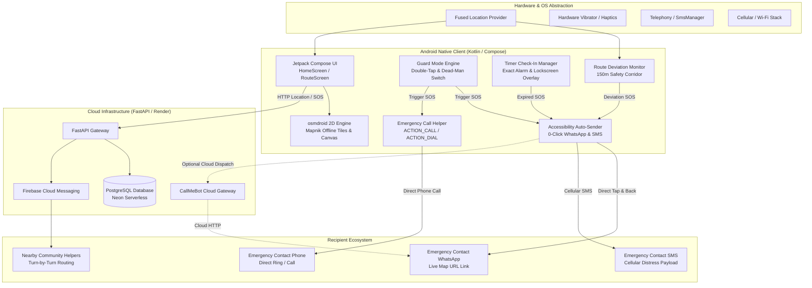

# 🛡️ LIFE GUARD: NEXT-GENERATION PERSONAL SAFETY & EMERGENCY RESPONSE SYSTEM
## Comprehensive Engineering, Technical Architecture & System Design Report

---

## 1. Executive Summary & Vision

**Life Guard** is an end-to-end, mission-critical personal safety and automated distress dispatch platform engineered to safeguard individuals in transit, precarious environments, and life-threatening emergencies. 

Traditional safety applications suffer from three catastrophic failure points during real-world distress situations:
1. **Physical Incapacitation Barrier**: If a victim is being attacked, abducted, or physically restrained, they cannot unlock their phone, navigate an interface, or press buttons.
2. **Connectivity & Carrier Failure**: Sideloaded safety apps are aggressively restricted by modern OS policies (Android 13/14/15 Google Play Protect), cellular SMS bundles run out of balance, and cellular signal drops.
3. **Proprietary API Deadlocks**: Reliance on proprietary mapping stacks (e.g., Google Maps API keys with credit card billing) introduces hard stops when quotas expire or API keys fail.

Life Guard solves these challenges through a **Zero-Tolerance-for-Failure Architecture**:
* **Autonomous Dead-Man Switching & Panic Detection**: Continuous finger-contact monitoring and double-tap accelerations.
* **Triple-Channel Automated Distress Dispatch**: Simultaneous execution of direct cellular calling (`ACTION_CALL`), automated WhatsApp emergency alerts with live GPS tracking links, and cellular SMS dispatch via dual-mode background/native fallback.
* **0-Click Accessibility Automation (`LifeGuardAccessibilityService`)**: Automatically bypasses third-party UI barriers (e.g., WhatsApp send confirmation) to dispatch distress payloads in ~100ms without user intervention.
* **100% Free & Open-Source Geospatial Engine (`osmdroid` + OSRM)**: Zero API keys, zero billing requirements, offline map caching, and real-time 120Hz freehand finger-drawn safety corridors.
* **Geospatial Mesh Network**: Server-side spatial querying and FCM high-priority data payloads alerting registered nearby helpers within a configurable safety radius.

---

## 2. System Architecture & Topology

The Life Guard ecosystem is split into two tightly decoupled layers: an **Android Native Client** built on modern Kotlin and Jetpack Compose, and a **Cloud Geospatial & Dispatch Engine** powered by FastAPI, PostgreSQL (Neon Serverless), and Firebase Cloud Messaging.

---

## 3. Core Subsystems & Technical Specifications

### 3.1. Guard Mode: Panic Detection & Dead-Man Switch
* **Panic SOS (Double-Tap)**: Detects rapid double-tap gestures on the primary guard shield within a 350ms window. Triggers instant, maximum-urgency dispatch with multi-pulse tactile vibration confirmation.
* **Dead-Man Switch (Continuous Press)**: Designed for walking alone at night or through hazardous terrain. The user maintains thumb contact with the shield.
  * *Disarm Window*: Upon finger release, a 5-second countdown with escalating audio-haptic pulses begins.
  * *PIN Override*: If the user does not enter their secret hashed PIN within 5 seconds, the system classifies the release as a forced abduction or incapacitation and immediately initiates silent distress dispatch.

### 3.2. Check-In Safety Timer & Lockscreen Overlay (`TimerCheckInActivity`)
* Uses Android's `AlarmManager.setExactAndAllowWhileIdle()` via `TimerCheckInReceiver` to ensure timer survival across aggressive OEM battery doze states.
* If a timer expires without check-in:
  1. Wakes up the CPU via a high-priority `WakeLock`.
  2. Launches `TimerCheckInActivity` directly over the Android keyguard (`FLAG_SHOW_WHEN_LOCKED`, `FLAG_TURN_SCREEN_ON`).
  3. Displays a 15-second emergency countdown accompanied by escalating dual-tone vibrations.
  4. If the user fails to provide their hashed PIN, the SOS pipeline executes across all channels.

### 3.3. Dual-Mode Route Deviation Engine (`RouteDeviationService`)
Life Guard provides two parallel methods for defining and enforcing travel routes:

1. **Google Maps Intent Ingestion (`RouteImportActivity`)**:
   * Registers Android intent filters for `Intent.ACTION_SEND` (text/plain) and `Intent.ACTION_VIEW` (`maps.app.goo.gl`, `google.com/maps`).
   * When a user taps "Share directions" in Google Maps, Life Guard intercepts the intent, follows HTTP redirects to unshorten the URL, extracts geographic waypoints via regex parsing, and fetches the polyline geometry via OSRM.
2. **Native 2D OpenStreetMap & Freehand Finger Draw (`RouteScreen.kt`)**:
   * Uses `org.osmdroid:osmdroid-android:6.1.18` rendering standard OpenStreetMap (Mapnik) tiles natively. **100% Free, zero Google Cloud billing, zero API keys**.
   * **Freehand Draw Mode**: The user toggles "✏️ Draw Route" and drags their finger across streets, alleyways, or campus pathways. A Jetpack Compose hardware-accelerated `Canvas` records touch coordinates at 120Hz with a glowing neon red trail (`#FF1744`).
   * **Pixel-to-Geo Projection**: Touch screen pixels are projected into real-world geographic coordinates (`org.osmdroid.util.GeoPoint`) using the active `MapView.projection`.

#### Route Corridor Mathematics (Cross-Track Deviation Algorithm)
For every incoming GPS fix $(p)$, the distance to the polyline safety corridor $(L)$ composed of line segments $s = (a, b)$ is calculated using cross-track geometric distance:

$$\text{distance}(p, s) = \begin{cases} 
\text{haversine}(p, a) & \text{if } t \le 0 \\
\text{haversine}(p, b) & \text{if } t \ge 1 \\
\text{haversine}(p, a + t(b - a)) & \text{if } 0 < t < 1 
\end{cases}$$

Where the scalar projection parameter $t$ is:
$$t = \frac{(p - a) \cdot (b - a)}{\|b - a\|^2}$$

* **Threshold**: If $\min_{s \in L} \text{distance}(p, s) > 150\text{ meters}$, a 15-second grace period is initiated.
* If the user fails to re-enter the corridor or supply the disarm PIN, `RouteDeviationActivity` fires the automated distress pipeline.

---

### 3.4. Triple-Channel Automated Emergency Dispatch System

| Channel | Protocol / API | Failure Mode Handled | Human Interaction Required |
| :--- | :--- | :--- | :--- |
| **📞 Direct Call** | `Intent.ACTION_CALL` (`CALL_PHONE`) | Recipient does not notice text messages | **0 clicks** (phone dials automatically) |
| **💬 WhatsApp Dispatch** | `LifeGuardAccessibilityService` + CallMeBot Gateway | Cellular SMS package expired / out of balance | **0 clicks** (auto-clicked in 100ms or silent cloud) |
| **📱 Cellular SMS** | `SmsManager` + Native Intent Fallback | Data / Wi-Fi disconnected | **0 clicks** (silent background or auto-clicked) |
| **🆘 Cloud Push** | HTTPS POST to FastAPI + Firebase FCM | Dispatches distress to nearby community helpers | **0 clicks** (instant background HTTP) |

#### Detailed Mechanics of 0-Click Accessibility Automation (`LifeGuardAccessibilityService.kt`)
Because WhatsApp does not expose a public silent background API for third-party applications, Life Guard integrates an official Android `AccessibilityService`:
1. When SOS fires, `LifeGuardAccessibilityService.armAutoSend()` activates with a 15-second safety timeout.
2. Life Guard dispatches the WhatsApp intent with pre-filled distress content and clickable Google Maps coordinates:
   `https://api.whatsapp.com/send?phone=+91XXXXXXXXXX&text=EMERGENCY+ALERT...`
3. As WhatsApp’s chat activity enters the foreground, the service captures the `TYPE_WINDOW_STATE_CHANGED` event.
4. It recursively scans the view hierarchy for the green send action:
   * By resource ID: `com.whatsapp:id/send`, `com.whatsapp.w4b:id/send`
   * By accessibility content description: `"Send"`, `"Send message"`
5. Executes `AccessibilityNodeInfo.ACTION_CLICK` on the send button.
6. Automatically issues `performGlobalAction(GLOBAL_ACTION_BACK)` after 300ms, returning the device to its previous state. The entire sequence completes without user intervention.

---

## 4. Security & Privacy Architecture

1. **Cryptographic PIN Protection**:
   * PINs are never stored in plaintext. They are salted and hashed locally using SHA-256 via `PinHasher.kt`.
   * Disarm verification occurs completely offline—an attacker who steals the device or severs network connectivity cannot disable alarms without the cryptographic secret.
2. **Android Play Protect & Sideloaded APK Resilience**:
   * Modern Android versions (13, 14, 15) flag sideloaded APKs under "Restricted Settings", blocking `SEND_SMS` and `BIND_ACCESSIBILITY_SERVICE`.
   * Life Guard incorporates an in-app diagnostic UI (`HomeScreen.kt`) that detects permission states in real time, directs users to the exact bypass toggle (*Settings ➔ Apps ➔ Life Guard ➔ 3 Dots ➔ Allow restricted settings*), and gracefully falls back to non-restricted APIs when permissions are pending.
3. **Fail-Safe Intent Handlers**:
   * If `ACTION_CALL` fails due to OEM dialer security restrictions, the system immediately cascades to `ACTION_DIAL`.
   * If `com.whatsapp` is not installed, the engine cascades to WhatsApp Business (`com.whatsapp.w4b`), and subsequently to standard mobile browser endpoints.

---

## 5. Technical Specifications & Dependencies

* **Android Architecture**: Single-Activity Jetpack Compose Architecture (`MainActivity.kt`), Navigation Compose.
* **Minimum SDK**: Android 8.0 (API Level 26).
* **Target SDK**: Android 14 / 15 (API Level 34).
* **Language Stack**: Kotlin 1.9.22, Java 17, Python 3.11 (Backend).
* **Core Libraries**:
  * Jetpack Compose BOM `2024.02.00` (Material 3)
  * Google Play Services Location `21.1.0`
  * OSMDroid Android Native SDK `6.1.18`
  * Retrofit 2.9.0 + OkHttp 4.12.0
  * Firebase Cloud Messaging `32.7.4`
  * Kotlin Coroutines `1.7.3`
* **Backend Stack**:
  * FastAPI 0.110.0 (Uvicorn ASGI)
  * SQLAlchemy 2.0.28 + asyncpg
  * Neon Serverless PostgreSQL
  * Firebase Admin SDK 6.5.0
  * Passlib (bcrypt) + python-jose (JWT)
